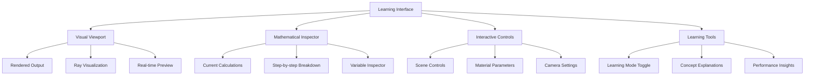
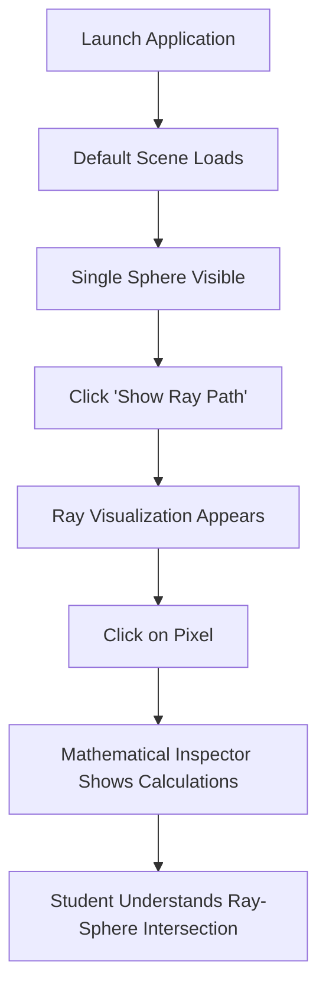
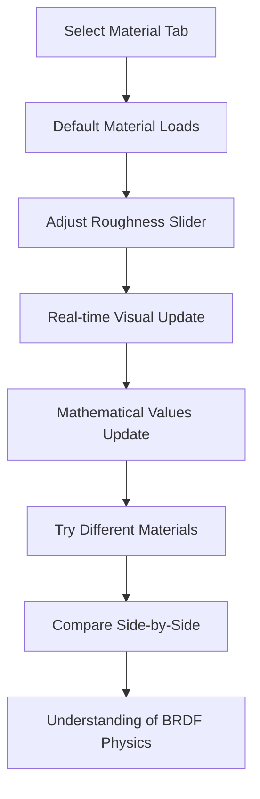

# 3D Pathtracer Learning Project UI/UX Specification

## Introduction

This document defines the user interface design for the 3D Pathtracer Learning Project, an educational rendering engine that prioritizes mathematical transparency and real-time parameter visualization.

**Core Interface Principle:** Expose rendering calculations and provide immediate visual feedback for parameter changes while maintaining a clean developer-focused aesthetic.

**Key Interface Areas:**
- Console output for mathematical results
- Real-time parameter controls  
- Ray visualization and debugging tools
- Performance monitoring dashboard

## Overall UX Goals & Principles

### Target User Personas

**Graphics Programming Student:** Learning ray tracing fundamentals through hands-on implementation

**Educational Developer:** Building understanding of rendering pipeline architecture from basic math to production quality

### Usability Goals

- **Mathematical Transparency:** Every calculation should be visible and inspectable
- **Immediate Feedback:** Parameter changes show instant visual and numerical results
- **Progressive Learning:** Interface complexity grows with implemented features (console → GUI controls → advanced debugging)
- **Educational Debugging:** Visual tools that illuminate ray behavior and energy calculations

### Design Principles

1. **Calculation Visibility** - Show intermediate mathematical results alongside final output
2. **Developer Tool Aesthetic** - Clean, functional design prioritizing information over polish
3. **Real-time Manipulation** - Every parameter should provide immediate visual feedback
4. **Educational Context** - Interface elements explain the underlying physics and algorithms
5. **Progressive Disclosure** - Start simple (console), expand to GUI as features develop

### Change Log

| Date | Version | Description | Author |
|------|---------|-------------|--------|
| 2025-08-10 | 1.0 | Initial UI/UX specification creation | UX Expert |

## Information Architecture (IA)

**Revised Approach:** Design for optimal student learning experience rather than implementation convenience. Prioritize immediate visual engagement with progressive mathematical detail exposure.

### Site Map / Screen Inventory

### Navigation Structure

**Primary Navigation:** Learning-focused tabs - Visual Results → Mathematical Detail → Advanced Tools

**Secondary Navigation:** Context-sensitive parameter panels that reveal mathematical details on demand

**Breadcrumb Strategy:** Concept-based progression showing learning path: Basic Rendering → Material Physics → Advanced Techniques

**Key Insight:** Students need visual engagement first, then mathematical understanding. The interface should inspire continued learning rather than present barriers to entry.

## User Flows

### Flow 1: First Ray Tracing Experience

**User Goal:** Understand basic ray-sphere intersection through immediate visual feedback

**Entry Points:** Application launch, "Getting Started" tutorial

**Success Criteria:** Student sees rendered sphere and understands the mathematical relationship between ray calculations and visual output

#### Flow Diagram

#### Edge Cases & Error Handling:
- No sphere visible: Clear error message with scene reset option
- Mathematical inspector overwhelming: Progressive detail levels
- Ray visualization too complex: Simplified single-ray mode

**Notes:** This flow prioritizes immediate visual gratification while making mathematical concepts accessible on demand.

### Flow 2: Material Parameter Exploration

**User Goal:** Understand how BRDF parameters affect material appearance through real-time manipulation

**Entry Points:** After basic rendering understanding, material learning module

**Success Criteria:** Student can predict material appearance changes and correlate parameters with visual results

#### Flow Diagram

#### Edge Cases & Error Handling:
- Extreme parameter values: Visual warnings with educational explanations
- Performance lag during real-time updates: Quality vs. speed toggle
- Confusing parameter relationships: Guided learning mode with hints

**Notes:** This flow emphasizes the connection between mathematics and visual appearance through interactive experimentation.

## Wireframes & Mockups

**Design Approach:** Start with console output, evolve to simple unified GUI interface as rendering capabilities develop.

### Key Screen Layout: Unified Learning Interface

**Purpose:** Single interface supporting visual output and mathematical exploration

**Key Elements:**
- Central rendering viewport
- Side panel for parameter controls  
- Expandable mathematical detail view
- Console output area for calculations

**Interaction Notes:** Click pixels to inspect calculations. Real-time parameter adjustment. Toggle mathematical detail on/off.

## Component Library / Design System

**Design System Approach:** Start with basic HTML/console components, evolve to lightweight GUI toolkit (Dear ImGui or similar) when visual interface development begins. Avoid complex design systems that would distract from core learning objectives.

### Core Components

#### Component 1: Mathematical Display

**Purpose:** Show ray tracing calculations in readable, educational format

**Variants:** 
- Inline calculation (single line result)
- Step-by-step breakdown (expandable detail)
- Formula display (with variable highlighting)

**States:** Loading, calculated, error, highlighted (when user inspects)

**Usage Guidelines:** Always show units, provide hover explanations for variables, use consistent mathematical notation

#### Component 2: Parameter Control

**Purpose:** Real-time adjustment of rendering parameters with immediate feedback

**Variants:**
- Slider (continuous values like roughness)
- Number input (precise values)
- Color picker (material colors)
- Dropdown (discrete choices like material presets)

**States:** Default, focused, disabled, invalid value

**Usage Guidelines:** Include parameter ranges, show current mathematical effect, provide preset values for common materials

#### Component 3: Console Output

**Purpose:** Structured display of calculations and debugging information

**Variants:**
- Basic output (simple text)
- Formatted output (with syntax highlighting)
- Interactive output (clickable values)

**States:** Streaming, complete, error, filtered

**Usage Guidelines:** Use monospace font, color-code different calculation types, maintain scrollback history

## Branding & Style Guide

### Visual Identity

**Brand Guidelines:** Educational developer tool aesthetic - clean, functional, and information-dense without being overwhelming. Think VS Code or Xcode styling rather than consumer graphics applications.

### Color Palette

| Color Type | Hex Code | Usage |
|------------|----------|--------|
| Primary | #2D3748 | Main interface backgrounds, primary text |
| Secondary | #4A5568 | Secondary panels, borders |
| Accent | #3182CE | Interactive elements, links, highlights |
| Success | #38A169 | Successful calculations, valid parameters |
| Warning | #D69E2E | Performance warnings, parameter limits |
| Error | #E53E3E | Calculation errors, invalid inputs |
| Neutral | #E2E8F0, #A0AEC0, #718096 | Text hierarchy, subtle borders, disabled states |

### Typography

#### Font Families
- **Primary:** System font stack (SF Pro, Segoe UI, Roboto) for UI elements
- **Secondary:** Same as primary for consistency
- **Monospace:** SF Mono, Consolas, Monaco for code and mathematical output

#### Type Scale

| Element | Size | Weight | Line Height |
|---------|------|---------|-------------|
| H1 | 24px | 600 | 1.2 |
| H2 | 20px | 600 | 1.3 |
| H3 | 16px | 600 | 1.4 |
| Body | 14px | 400 | 1.5 |
| Small | 12px | 400 | 1.4 |

### Iconography

**Icon Library:** Lucide or Heroicons for consistent, minimal developer-focused icons

**Usage Guidelines:** Use icons sparingly, prioritize text labels for educational clarity, maintain consistent sizing (16px/20px)

### Spacing & Layout

**Grid System:** 8px base unit for consistent spacing and alignment

**Spacing Scale:** 4px, 8px, 16px, 24px, 32px, 48px progression for margins and padding

## Accessibility Requirements

### Compliance Target

**Standard:** Basic accessibility principles rather than formal WCAG compliance - focus on readable text, keyboard navigation, and clear visual hierarchy for educational effectiveness.

### Key Requirements

**Visual:**
- Color contrast ratios: Minimum 4.5:1 for normal text, 3:1 for large text (supports readability of mathematical formulas)
- Focus indicators: Clear visual focus states for all interactive elements
- Text sizing: Scalable text that remains readable at 150% zoom (important for detailed mathematical output)

**Interaction:**
- Keyboard navigation: Tab-based navigation through parameter controls and interface elements
- Screen reader support: Semantic HTML structure with proper headings and labels (helps with code organization)
- Touch targets: Minimum 44px for clickable elements (future touch interface consideration)

**Content:**
- Alternative text: Descriptive alt text for ray visualization graphics and mathematical diagrams
- Heading structure: Logical H1-H6 hierarchy for mathematical concepts and interface sections
- Form labels: Clear labels for all parameter input fields with units and ranges

### Testing Strategy

**Basic Testing Approach:** Keyboard-only navigation testing and high-contrast mode validation to ensure interface remains functional and readable under different conditions.

## Responsiveness Strategy

**Design Priority:** Desktop-first for development environments. Support laptop and external monitor configurations.

### Breakpoints

| Breakpoint | Min Width | Target Use Case |
|------------|-----------|-----------------|
| Laptop | 1280px | MacBook development |
| Desktop | 1920px+ | External monitors, ultrawide displays |

### Adaptation Patterns

**Layout Changes:** Flexible layout that scales from laptop to wide monitors. Single unified interface.

**Content Priority:** Mathematical output and visual viewport scale proportionally. All features remain accessible.

## Animation & Micro-interactions

**Design Philosophy:** Prioritize mathematical accuracy and immediate feedback over polished animations. Focus development effort on core rendering features rather than interface polish.

### Motion Principles

**Mathematical Precision First:** Favor instant, accurate updates over smooth transitions. Students need immediate cause-and-effect feedback to understand parameter relationships.

**Minimal Animation Overhead:** Avoid animations that compete with rendering performance or distract from mathematical learning objectives.

### Key Interactions

- **Immediate Parameter Feedback:** Instant visual updates when material parameters change (no transition delays)
- **Mathematical Value Updates:** Direct numerical updates without counter animations
- **Basic Focus Indicators:** Simple highlight states for interactive elements (no elaborate transitions)
- **Essential Loading States:** Simple progress indicators for rendering operations only when necessary

**Key Insight:** Professional rendering tools prioritize immediate, accurate feedback over polished animations. Educational value comes from mathematical transparency, not interface sophistication.

## Performance Considerations

### Performance Goals

- **Page Load:** Interface should load instantly, rendering engine initialization is separate concern
- **Interaction Response:** Parameter changes should update interface in <16ms to maintain 60fps responsiveness
- **Animation FPS:** No complex animations - simple state changes only

### Design Strategies

**Lightweight Interface:** Minimize DOM complexity and avoid heavy JavaScript frameworks that would compete with rendering calculations for CPU resources.

**Separation of Concerns:** Interface performance must not impact rendering performance. UI updates should never block ray tracing calculations.

**Developer-Focused Optimization:** Optimize for development workflow efficiency rather than end-user polish. Fast iteration cycles are more important than smooth animations.

**Resource Prioritization:** Rendering engine gets priority access to CPU and GPU resources. Interface uses remaining capacity only.

**Measurement Strategy:** Monitor interface overhead to ensure it doesn't interfere with ray tracing performance learning objectives. Profile rendering vs. interface resource usage separately.

**Key Principle:** The interface should be invisible to performance - students should be learning rendering optimization, not fighting interface bottlenecks.

## Next Steps

### Immediate Actions

1. **Begin Epic 1 console implementation** using the mathematical display and console output components defined in this specification
2. **Set up basic project structure** following the lightweight interface architecture outlined
3. **Validate design decisions** against actual ray tracing implementation needs as development progresses
4. **Create simple HTML mockup** of the unified learning interface for GUI development phases

### Design Handoff Checklist

- [x] All user flows documented (First Ray Tracing Experience, Material Parameter Exploration)
- [x] Component inventory complete (Mathematical Display, Parameter Control, Console Output)
- [x] Accessibility requirements defined (basic readability and keyboard navigation)
- [x] Responsive strategy clear (desktop-focused development environments)
- [x] Brand guidelines incorporated (developer tool aesthetic, educational focus)
- [x] Performance goals established (interface should not compete with rendering performance)

### Key Recommendations

**Start Simple:** Begin with console-based interface for Epic 1, then gradually evolve to GUI as rendering capabilities develop. This aligns with your learning progression and avoids premature interface complexity.

**Focus on Mathematics:** Prioritize mathematical transparency and immediate feedback over polished visual design. The interface should enhance learning, not distract from it.

**Performance First:** Ensure interface development never compromises rendering performance learning objectives. Students should be optimizing ray tracing, not fighting interface bottlenecks.
