# 3D Pathtracer Learning Project Architecture Document

## Introduction

This document outlines the complete system architecture for **3D Pathtracer Learning Project**, a native C++ educational rendering engine that bridges mathematical transparency with production-quality patterns. Unlike traditional fullstack web applications, this "fullstack" encompasses the complete rendering pipeline: backend ray tracing engine + frontend interactive interface + industry-standard content pipeline integration.

**Critical Architectural Principle:** **Education-First with Production Patterns** - Every architectural decision must demonstrably serve learning objectives while establishing transferable industry patterns. When conflicts arise, educational transparency takes precedence in early epics, with production quality becoming dominant in later phases.

### Architectural Decision Framework

To address the inherent tension between educational and production requirements, this architecture establishes clear decision criteria:

**Epic 1-2 (Foundation):** Prioritize mathematical transparency and build system simplicity. Accept some performance overhead for educational clarity.

**Epic 3-4 (Industry Standards):** Balance educational visibility with industry pattern adoption. Introduce abstractions gradually with clear before/after comparisons.

**Epic 5-6 (Production Quality):** Prioritize production patterns while maintaining educational documentation of optimization decisions.

### Platform Strategy

**Primary Platform:** macOS Apple Silicon for optimization learning
**Cross-Platform Foundation:** Abstract SIMD operations and rendering backends from Epic 1 using preprocessor directives and function pointers, not complex abstraction hierarchies.

**Risk Mitigation:** Build minimal cross-platform compatibility early (console interface works everywhere) rather than waiting until Epic 6 for platform abstraction.

### Starter Template Decision

**Status:** Greenfield C++ project with **educational-specific build system**

**Key Insight:** Rather than following traditional CMake patterns, the build system will prioritize:
1. **Single Command Setup:** `./build.sh` works on any system with minimal dependencies
2. **Educational Visibility:** Build process shows exactly what's happening (no hidden CMake complexity)  
3. **Incremental Complexity:** Build requirements grow with epic progression, not front-loaded

**Risk Mitigation:** Prototype build system and Dear ImGui integration in Epic 1 to validate architectural assumptions before committing to later epic dependencies.

### Change Log

| Date | Version | Description | Author |
|------|---------|-------------|--------|
| 2025-08-10 | 1.0 | Initial architecture with risk mitigation strategies | Winston (Architect) |

## High Level Architecture

### Technical Summary

The **3D Pathtracer Learning Project** implements a **modular native C++ architecture** with progressive complexity management, deployed as a **single educational executable** with console-to-GUI interface evolution. The **Apple Silicon-optimized rendering backend** integrates with a **lightweight educational frontend** (Dear ImGui) through a **plugin-based renderer abstraction**. Key integration points include **real-time parameter binding** between UI controls and BRDF calculations, **educational debugging visualization** overlays, and **industry-standard content pipeline** (MaterialX/USD) integration. The architecture supports **seamless platform abstraction** while optimizing for Apple Silicon NEON vectorization and Metal Performance Shaders, achieving PRD goals through **incremental feature progression** from single-ray console output to production-quality hybrid rendering with comprehensive mathematical transparency.

### Platform and Infrastructure Choice

**Platform:** Apple Silicon (macOS) with cross-platform abstraction layer  
**Key Services:** Native C++ executable, Dear ImGui UI framework, Metal Performance Shaders, NEON vectorization  
**Deployment Host and Regions:** Local development environment (single-user educational tool)

### Repository Structure

**Structure:** Educational Monorepo with Epic Progression  
**Monorepo Tool:** Custom CMake configuration (not Nx/Turborepo - those are for web projects)  
**Package Organization:** Epic-based modules with clear educational progression and shared mathematical foundations

### High Level Architecture Diagram


### Architectural Patterns

- **Educational Progression Pattern:** Incremental complexity management from single-file to modular architecture - _Rationale:_ Allows students to understand each abstraction layer as it's introduced rather than overwhelming with full architecture complexity

- **Plugin-Based Renderer Architecture:** Abstract renderer interface supporting console, software, and future GPU backends - _Rationale:_ Enables experimentation with different rendering approaches while maintaining educational interface consistency

- **Mathematical Transparency Pattern:** Every calculation exposed through debugging interfaces with step-by-step breakdown - _Rationale:_ Core educational requirement for understanding ray tracing mathematics in practice

- **Platform Abstraction with Optimization Hooks:** Cross-platform base implementation with platform-specific optimization injection points - _Rationale:_ Balances educational accessibility with Apple Silicon optimization learning objectives

- **Industry Standards Integration Pattern:** Gradual introduction of MaterialX/USD through educational wrappers before full industry API exposure - _Rationale:_ Prevents external library complexity from overwhelming core graphics learning

- **Performance Monitoring as Educational Tool:** Built-in profiling and statistics generation for educational insight rather than production optimization - _Rationale:_ Students learn optimization thinking through measurement and analysis, not just theoretical knowledge

## Tech Stack

This is the **DEFINITIVE technology selection** for the entire project. All development must use these exact versions and approaches. The stack is optimized for Apple Silicon while maintaining cross-platform extensibility through abstraction layers.

## Progressive Dependency Management Strategy

The project follows a **progressive dependency introduction** approach, aligning with the epic-based learning progression to prevent overwhelming students with complex external libraries while building towards industry-standard tools.

### Epic-Based Dependency Introduction

**Epic 1 (Foundation): Zero External Dependencies**
- **Philosophy**: Pure C++ implementation for mathematical transparency
- **Dependencies**: None - completely self-contained educational code
- **Build Requirements**: C++20 compiler, CMake 3.25+
- **Rationale**: Students focus on ray tracing mathematics without library complexity

**Epic 2 (Visual Foundation): Minimal UI Dependencies**
- **New Dependencies**: 
  - Dear ImGui 1.90+ (git submodule)
  - GLFW (system package: `brew install glfw` / `apt install libglfw3-dev`)
  - OpenGL (system-provided)
  - STB libraries (single-header: stb_image.h, stb_image_write.h)
- **Integration Strategy**: Git submodules for Dear ImGui, direct download for STB headers
- **Rationale**: Lightweight UI for real-time parameter manipulation without complex frameworks

**Epic 3-4 (Advanced Materials): Mathematical Validation Dependencies**
- **New Dependencies**:
  - GLM 0.9.9+ (optional for mathematical validation)
- **Integration Strategy**: Header-only library via package manager or git submodule
- **Rationale**: Industry reference for validating student's mathematical implementations

**Epic 5-6 (Optional Advanced): Industry Integration Dependencies**
- **New Dependencies** (Optional Advanced Modules):
  - MaterialX 1.38+ (Academy Software Foundation standard)
  - USD Core 23.05+ (Pixar Universal Scene Description)
  - OpenEXR 3.1+ (High dynamic range imaging)
- **Integration Strategy**: vcpkg or manual building for complex libraries
- **Rationale**: Industry exposure without overwhelming core educational objectives

### Cross-Platform Setup Scripts

**Automated Dependency Setup:**

`tools/setup_dependencies.sh`:
```bash
#!/bin/bash
# Educational ray tracer dependency setup
# Supports: macOS (Apple Silicon + Intel), Ubuntu Linux

echo "=== Ray Tracing Learning Project Setup ==="

# Detect platform and install dependencies
if [[ "$OSTYPE" == "darwin"* ]]; then
    echo "Detected macOS - Installing dependencies via Homebrew"
    if ! command -v cmake &> /dev/null; then
        brew install cmake
    fi
    # Epic 2+ dependencies
    brew install glfw
    echo "✅ Epic 1-2 dependencies ready"
elif [[ "$OSTYPE" == "linux-gnu"* ]]; then
    echo "Detected Linux - Installing dependencies via apt"
    sudo apt-get update
    sudo apt-get install -y cmake build-essential libglfw3-dev libgl1-mesa-dev
    echo "✅ Epic 1-2 dependencies ready"
fi

# Setup git submodules for Epic 2+
if [[ -d ".git" ]]; then
    git submodule add https://github.com/ocornut/imgui.git external/imgui 2>/dev/null || true
    git submodule update --init --recursive
fi

# Download STB headers
mkdir -p external/stb
if [[ ! -f "external/stb/stb_image.h" ]]; then
    curl -o external/stb/stb_image.h https://raw.githubusercontent.com/nothings/stb/master/stb_image.h
    curl -o external/stb/stb_image_write.h https://raw.githubusercontent.com/nothings/stb/master/stb_image_write.h
fi

echo "🎓 Setup complete! Run: ./tools/build_simple.sh"
```

**5-Minute Setup Validation:**

`tools/validate_setup.sh`:
```bash
#!/bin/bash
echo "=== Validating Educational Setup ==="

# Check Epic 1 requirements
if g++ --version | grep -q "c++20\|c++2a" || clang++ --version &> /dev/null; then
    echo "✅ C++20 compiler available"
else 
    echo "❌ C++20 compiler required"
    exit 1
fi

if cmake --version | grep -q "3\.[2-9][0-9]\|[4-9]\."; then
    echo "✅ CMake 3.25+ available"
else
    echo "❌ CMake 3.25+ required"
    exit 1
fi

# Epic 2+ validation
if [[ -d "external/imgui" ]] && [[ -f "external/stb/stb_image.h" ]]; then
    echo "✅ Epic 2+ dependencies ready"
else
    echo "⚠️  Epic 2+ dependencies missing - run setup_dependencies.sh"
fi

echo "🎓 Setup validation complete"
```

### CMake Integration Strategy

**Progressive CMakeLists.txt Configuration:**

```cmake
# CMakeLists.txt - Epic progression support
cmake_minimum_required(VERSION 3.25)
project(RayTracerLearning VERSION 1.0.0)

set(CMAKE_CXX_STANDARD 20)
set(CMAKE_CXX_STANDARD_REQUIRED ON)

# Epic 1: Pure C++ implementation
add_executable(raytracer
    src/main.cpp
    src/core/vector3.hpp
    src/core/ray.hpp
)

# Epic 1: Mathematical validation tests
add_executable(test_math_correctness
    tests/test_math_correctness.cpp
    src/core/vector3.hpp
)

# Epic 2+: Dear ImGui integration (optional)
if(EXISTS ${CMAKE_CURRENT_SOURCE_DIR}/external/imgui AND ENABLE_UI)
    message(STATUS "Epic 2+ build: Adding Dear ImGui support")
    
    # Dear ImGui sources
    set(IMGUI_DIR ${CMAKE_CURRENT_SOURCE_DIR}/external/imgui)
    file(GLOB IMGUI_SOURCES
        ${IMGUI_DIR}/*.cpp
        ${IMGUI_DIR}/backends/imgui_impl_glfw.cpp
        ${IMGUI_DIR}/backends/imgui_impl_opengl3.cpp
    )
    
    # System dependencies
    find_package(glfw3 REQUIRED)
    find_package(OpenGL REQUIRED)
    
    # Add UI sources and dependencies
    target_sources(raytracer PRIVATE ${IMGUI_SOURCES})
    target_include_directories(raytracer PRIVATE ${IMGUI_DIR} ${IMGUI_DIR}/backends)
    target_link_libraries(raytracer glfw OpenGL::GL)
    
    target_compile_definitions(raytracer PRIVATE ENABLE_UI=1)
else()
    message(STATUS "Epic 1 build: Console-only ray tracer")
    target_compile_definitions(raytracer PRIVATE ENABLE_UI=0)
endif()

# STB single-header libraries (Epic 2+)
target_include_directories(raytracer PRIVATE ${CMAKE_CURRENT_SOURCE_DIR}/external/stb)

# Epic 3+: Optional GLM for validation
find_package(glm QUIET)
if(glm_FOUND)
    target_link_libraries(raytracer glm::glm)
    target_compile_definitions(raytracer PRIVATE HAS_GLM=1)
endif()

# Epic 5-6: Advanced dependencies (optional)
option(ENABLE_ADVANCED_FEATURES "Enable MaterialX and USD integration" OFF)
if(ENABLE_ADVANCED_FEATURES)
    find_package(MaterialXCore QUIET)
    find_package(pxr QUIET)
    find_package(OpenEXR QUIET)
    
    if(MaterialXCore_FOUND)
        target_link_libraries(raytracer MaterialXCore)
        target_compile_definitions(raytracer PRIVATE HAS_MATERIALX=1)
    endif()
    
    if(pxr_FOUND)
        target_link_libraries(raytracer ${PXR_LIBRARIES})
        target_compile_definitions(raytracer PRIVATE HAS_USD=1)
    endif()
endif()
```

### Technology Stack Table

| Category | Technology | Version | Purpose | Rationale |
|----------|------------|---------|---------|-----------|
| **Core Language** | C++ | C++20/C++23 | Primary implementation language | Modern features, performance, industry relevance for graphics programming |
| **Build System** | CMake | 3.25+ | Cross-platform build management | Industry standard with Apple Silicon optimization support |
| **UI Framework** | Dear ImGui | 1.90+ | Educational parameter controls and debugging | Immediate mode perfect for real-time mathematical parameter manipulation |
| **Graphics Backend** | Metal | Latest | Apple Silicon GPU acceleration | Native Apple optimization, MPS integration, educational GPU learning |
| **SIMD Abstraction** | Custom + NEON | Native | Cross-platform vectorization | Educational SIMD learning with Apple Silicon optimization |
| **Mathematical Library** | Custom + GLM | 0.9.9+ | Linear algebra and validation | Educational implementation with industry reference validation |
| **Image I/O** | stb_image | Latest | PNG/JPEG output | Simple single-header library, minimal dependencies |
| **HDR Images** | OpenEXR | 3.1+ | High dynamic range support | Industry standard for realistic rendering |
| **Threading** | std::thread + Custom Pool | C++20 | CPU parallelization | Educational threading patterns with work-stealing queues |
| **Memory Management** | Custom Allocators | Native | Cache-friendly patterns | Apple Silicon memory hierarchy optimization learning |
| **MaterialX** | MaterialX | 1.38+ | Node graph evaluation | Academy Software Foundation standard |
| **USD Support** | USD Core | 23.05+ | Scene description loading | Pixar industry standard for scene data |
| **Testing Framework** | Custom + Catch2 | 3.4+ | Mathematical validation | Educational test patterns with graphics-specific validation |
| **Performance Profiling** | Custom + Instruments | Native | Educational performance analysis | Apple Silicon profiling integration |
| **Documentation** | Doxygen | 1.9+ | Code documentation | Industry standard with mathematical formula support |
| **Version Control** | Git | 2.40+ | Source control | Standard development workflow |
| **CI/CD** | GitHub Actions | Latest | Cross-platform validation | Automated testing on multiple platforms |
| **Cross-Platform Graphics** | OpenGL (Fallback) | 4.1+ | Non-Apple platform support | Compatibility layer for cross-platform development |

## Data Models

The core data models represent the mathematical and scene entities shared between the rendering engine and educational interface, **enhanced with educational debugging infrastructure and real-time parameter binding** to support the interactive learning experience.

### Vector3 (Enhanced with Educational Features)

**Purpose:** Fundamental 3D mathematical operations with **calculation history tracking** and **educational validation**

**Key Attributes:**
- x, y, z: float - Components optimized for SIMD operations
- Clean, minimal interface suitable for Apple Silicon NEON vectorization

#### TypeScript Interface
```cpp
class Vector3 {
public:
    float x, y, z;
    
    // Core mathematical operations - optimized and clean
    Vector3(float x = 0.0f, float y = 0.0f, float z = 0.0f) : x(x), y(y), z(z) {}
    
    float dot(const Vector3& other) const;
    Vector3 cross(const Vector3& other) const;  
    Vector3 normalized() const;
    float length() const;
    float length_squared() const;
    
    // Standard arithmetic operators
    Vector3 operator+(const Vector3& other) const;
    Vector3 operator-(const Vector3& other) const;  
    Vector3 operator*(float scalar) const;
    
    // Production validation (minimal overhead)
    bool is_finite() const;
    bool is_normalized(float tolerance = 0.001f) const;
};
```

#### Educational Inspection Layer (Separate)
```cpp
class Vector3Inspector {
public:
    static std::string explain_dot_product(const Vector3& a, const Vector3& b, float result);
    static std::string explain_cross_product(const Vector3& a, const Vector3& b, const Vector3& result);
    static std::string explain_normalization(const Vector3& input, const Vector3& result);
    
    // Optional calculation tracking (enabled only when needed)
    static void enable_calculation_tracking(bool enable);
    static std::vector<std::string> get_recent_calculations();
    static void clear_calculation_history();
    
private:
    static thread_local std::vector<std::string> calculation_log;
    static std::atomic<bool> tracking_enabled;
};
```

### Material (Clean Core with Parameter Binding Adapter)

**Purpose:** Surface material properties for BRDF evaluation

#### TypeScript Interface  
```cpp
enum class MaterialType {
    Lambert,
    CookTorrance, 
    OpenPBR
};

class Material {
public:
    Vector3 base_color;
    float roughness;
    float metallic;
    float specular;
    Vector3 emission;
    MaterialType type;
    
    Material(const Vector3& color = Vector3(0.7f, 0.7f, 0.7f),
             float roughness = 0.5f,
             MaterialType type = MaterialType::Lambert);
    
    // Core BRDF evaluation - clean and fast
    Vector3 evaluate_brdf(const Vector3& wi, const Vector3& wo, const Vector3& normal) const;
    
    // Production validation
    bool validate_parameters() const;
    void clamp_to_valid_ranges();
};
```

### Scene (Clean Core with Educational Monitoring)

**Purpose:** Scene container optimized for rendering performance

#### TypeScript Interface
```cpp
class Scene {
public:
    std::vector<Primitive> primitives;
    std::vector<Material> materials;
    std::vector<Light> lights;
    Camera camera;
    Vector3 background;
    
    Scene() = default;
    
    struct Intersection {
        bool hit;
        float t;
        Vector3 point;
        Vector3 normal;  
        const Material* material;
        const Primitive* primitive;
    };
    
    Intersection intersect(const Ray& ray) const;
    
    // Standard scene management
    int add_material(const Material& material);
    int add_primitive(const Primitive& primitive);
    void set_camera(const Camera& camera);
};
```

## Refined API Specification - Educational Clarity Focus

**Core Principle:** Simple, clear progression from Epic 1 functions to Epic 6 optimized classes with consistent educational debugging and single-source-of-truth control.

### Unified Educational Control System

#### Single Educational Mode Controller
```cpp
namespace EducationalMode {
    enum Level {
        Production,    // No educational overhead - Epic 6 target
        Learning,      // Essential explanations - Epic 2-4 balance  
        Debugging      // Full mathematical transparency - Epic 1 start
    };
    
    void set_level(Level level);
    Level get_level();
    
    // All educational features controlled through this single system
    bool is_explanation_enabled();      // Controls all explanation methods
    bool is_console_output_enabled();   // Controls all printf/console output
    bool is_validation_enabled();       // Controls all mathematical validation
    
    // Simple memory management for educational features
    void set_max_memory_mb(int max_mb); // Limits educational data storage
    void cleanup_educational_data();    // Clears old calculation logs
}
```

### Epic 1: Foundation API - Maximum Simplicity

**Purpose:** Single-file functions with complete mathematical transparency

#### Core Educational Functions
```cpp
namespace Epic1 {
    
    // Students start with this single function call
    Vector3 trace_single_ray() {
        // Hard-coded educational example with full mathematical breakdown
        // Students see every calculation step in the actual implementation
        
        if (EducationalMode::is_console_output_enabled()) {
            printf("=== Epic 1: Single Ray Tracing Calculation ===\n");
        }
        
        // All mathematics visible in the implementation, not separate explanation functions
        Ray camera_ray(Vector3(0, 0, 0), Vector3(0, 0, -1));
        Vector3 sphere_center(0, 0, -5);
        float sphere_radius = 1.0f;
        
        // Ray-sphere intersection with educational comments IN the code
        Vector3 oc = camera_ray.origin - sphere_center;
        float b = oc.dot(camera_ray.direction);
        float c = oc.dot(oc) - sphere_radius * sphere_radius;
        float discriminant = b * b - c;
        
        if (EducationalMode::is_console_output_enabled()) {
            printf("Ray-sphere intersection: b=%g, c=%g, discriminant=%g\n", b, c, discriminant);
        }
        
        if (discriminant < 0) return Vector3(0.2f, 0.2f, 0.8f);
        
        float t = -b - sqrt(discriminant);
        Vector3 hit_point = camera_ray.point_at(t);
        Vector3 normal = (hit_point - sphere_center).normalized();
        
        // Lambert BRDF calculation
        Vector3 light_pos(2, 2, 0);
        Vector3 light_dir = (light_pos - hit_point).normalized();
        float cos_theta = std::max(0.0f, normal.dot(light_dir));
        
        Vector3 material_color(0.7f, 0.3f, 0.3f);
        Vector3 final_color = material_color * cos_theta;
        
        if (EducationalMode::is_console_output_enabled()) {
            printf("Lambert shading: cos(θ)=%g, final_color=(%g,%g,%g)\n", 
                   cos_theta, final_color.x, final_color.y, final_color.z);
        }
        
        return final_color;
    }
}
```

## Components

Based on the refined hybrid educational architecture, the system components follow the epic progression from simple single-file implementation to modular production-quality architecture. Each component serves both educational transparency and performance objectives through evolutionary development.

### Epic 1: Single-File Educational Component

**Responsibility:** Complete ray tracing demonstration in maximum educational transparency

**Key Interfaces:**
- `Epic1::trace_single_ray()` - Hard-coded educational example with full mathematical breakdown
- `Epic1::trace_ray_with_parameters()` - Parameterized version for student exploration

**Dependencies:** None - completely self-contained for educational clarity

**Technology Stack:** Pure C++ with educational console output, no external dependencies

### Ray Tracing Engine Core

**Responsibility:** Core mathematical ray tracing operations that students implement and evolve across all epics

**Key Interfaces:**
- `Ray` class - Light ray representation with educational debugging
- `Material::evaluate_brdf()` - BRDF evaluation (Lambert → Cook-Torrance → OpenPBR progression)
- `Scene::intersect()` - Ray-scene intersection testing
- `Camera::generate_ray()` - Primary ray generation from camera

**Dependencies:** EducationalMode controller, Vector3 mathematical foundation

**Technology Stack:** C++ with progressive optimization (scalar → SIMD → multi-threaded)

### Mathematical Foundation Component

**Responsibility:** Core mathematical operations (Vector3, Matrix4x4) with educational transparency and optimization progression

**Key Interfaces:**
- `Vector3::dot()`, `Vector3::cross()`, `Vector3::normalized()` - Basic vector operations
- Mathematical validation and educational explanation methods

**Dependencies:** EducationalMode controller for optional transparency features

**Technology Stack:** Custom C++ implementation progressing from educational verbosity to NEON-optimized SIMD

### Educational Control System

**Responsibility:** Unified control of educational features across all components

**Key Interfaces:**
- `EducationalMode::set_level()` - Single control point for educational transparency
- `EducationalMode::is_explanation_enabled()` - Consistent educational feature querying
- Educational memory management and cleanup

**Dependencies:** None - provides services to all other components

**Technology Stack:** C++ with thread-safe atomic operations for educational state management

## Core Workflows

The core workflows illustrate key system interactions across the epic progression, showing how educational transparency integrates with mathematical calculations and user interactions.

### Epic 1: First Ray Tracing Experience Workflow


### Epic 2: Real-time Material Parameter Manipulation Workflow

```mermaid
sequenceDiagram
    participant Student
    participant ImGuiUI
    participant Material
    participant EducationalMode
    participant RayTracer
    participant Display
    
    Student->>ImGuiUI: Adjust roughness slider
    ImGuiUI->>Material: Set roughness = 0.8f
    
    Material->>EducationalMode: Check is_explanation_enabled()
    EducationalMode-->>Material: true (Learning level)
    Material->>Console: printf("Roughness=0.8: Surface becomes rough")
    
    ImGuiUI->>RayTracer: Trigger re-render
    RayTracer->>Scene: intersect(ray)
    Scene-->>RayTracer: Intersection with Material*
    
    RayTracer->>Material: evaluate_brdf(wi, wo, normal)
    Material->>Material: Calculate Cook-Torrance BRDF
    Note over Material: D = alpha²/(π * denom²)<br/>G = masking/shadowing<br/>F = Fresnel reflection
    
    Material->>EducationalMode: Check is_console_output_enabled()
    EducationalMode-->>Material: true
    Material->>Console: printf("Cook-Torrance: D=%g, result=(%g,%g,%g)")
    
    Material-->>RayTracer: Return BRDF result
    RayTracer->>Display: Update pixel colors
    Display-->>Student: Visual feedback (rougher appearance)
    
    Student->>Console: Observe mathematical correlation
    Note over Student: Sees roughness parameter<br/>affect D term calculation<br/>and final visual result
```



## Risk-Mitigated Project Structure - Simplified Educational Focus

**Core Architectural Decision:** Single evolving codebase with git-based epic checkpoints, eliminating code duplication and reducing project management complexity while maintaining clear learning progression.

```
raytracer/
├── src/                               # Single evolving codebase - students work here throughout all epics
│   ├── main.cpp                       # Evolution: Epic 1 single-ray → Epic 6 production ray tracer
│   ├── core/                          # Core mathematical and rendering components
│   │   ├── vector3.hpp                # Students implement once, optimize progressively
│   │   ├── ray.hpp                    # Single Ray class, features added per epic
│   │   ├── material.hpp               # Single Material class, BRDF methods added progressively
│   │   ├── scene.hpp                  # Single Scene class, complexity grows with epics
│   │   ├── camera.hpp                 # Camera implementation added in Epic 2
│   │   └── educational_mode.hpp       # Unified educational control - single system
│   ├── materials/                     # Material implementations added as students progress
│   │   ├── lambert.cpp                # Epic 1 - students implement first
│   │   ├── cook_torrance.cpp          # Epic 3 - students add to existing Material class
│   │   └── openpbr.cpp                # Epic 4 - students extend further (optional)
│   ├── ui/                            # Dear ImGui integration (Epic 2+)
│   │   ├── main_window.cpp            # Simple main interface
│   │   └── educational_inspector.cpp  # Mathematical transparency controls
│   └── platform/                      # Platform abstraction (Epic 6)
│       ├── simd.hpp                   # SIMD abstraction: NEON + fallback
│       └── threading.cpp              # Multi-threading (Epic 6, optional)
├── external/                          # Minimal external dependencies
│   └── imgui/                         # Dear ImGui submodule (Epic 2+)
├── epic_checkpoints/                  # Git-based learning milestones
│   ├── epic1_foundation.md            # Epic 1 completion criteria and validation
│   ├── epic2_visual_foundation.md     # Epic 2 refactoring guidance
│   ├── epic3_cook_torrance.md         # Epic 3 microfacet theory implementation
│   ├── epic4_advanced_materials.md    # Epic 4 optional advanced features
│   ├── epic5_industry_exploration.md  # Epic 5 simplified industry concepts
│   └── epic6_apple_optimization.md    # Epic 6 optional performance learning
├── tests/                             # Streamlined testing focused on mathematical correctness
│   ├── test_math_correctness.cpp      # Core mathematical validation (energy conservation, etc.)
│   ├── test_visual_regression.cpp     # Simple reference image comparison
│   └── reference_images/              # Expected outputs for validation
├── tools/                             # Simplified educational tools
│   ├── validate_epic.sh               # Single epic validation script
│   ├── build_simple.sh                # One-command build for all platforms
│   └── educational_report.cpp         # Learning progress analysis
├── docs/                              # Streamlined educational documentation
│   ├── README.md                      # Getting started guide
│   ├── learning_path.md               # Epic progression guide
│   └── mathematical_reference.md      # Ray tracing math reference
├── assets/                            # Minimal test assets
│   ├── simple_scene.scene             # Basic scene for all epics
│   └── reference_materials.mtl        # Material examples
├── CMakeLists.txt                     # Single, simple build configuration
├── .gitignore                         # Standard C++ gitignore
└── LICENSE                            # Educational license
```

## Deployment Architecture

Based on the simplified single-codebase educational architecture, deployment focuses on **local development environments** rather than traditional web application deployment patterns.

### Deployment Strategy

**Educational Application Deployment:**
- **Platform:** Native C++ executable for local development and learning
- **Build Command:** `./tools/build_simple.sh` (single command for all platforms)
- **Output Directory:** `build/` directory with `raytracer` executable
- **Distribution Method:** Git repository cloning with educational progression through branches

**Development Environment Requirements:**
- **Primary Platform:** macOS with Apple Silicon for optimization learning (Epic 6)
- **Secondary Platform:** macOS Intel and Linux for cross-platform compatibility validation
- **Minimum Requirements:** C++20 compiler, basic OpenGL support, git
- **Educational Dependencies:** Dear ImGui (bundled), STB libraries (single-header)

## Testing Strategy

The testing approach focuses on **mathematical correctness validation** and **educational learning verification** rather than traditional software testing patterns.

### Educational Testing Pyramid

```
              Learning Validation Tests
                 /              \
         Mathematical Tests    Visual Tests
        /                    \              \
   Unit Tests         Integration Tests   Performance Tests
```

### Core Testing Framework

#### Mathematical Correctness Testing
```cpp
// tests/test_math_correctness.cpp - Primary educational validation
#include "src/core/vector3.hpp"
#include "src/core/material.hpp"
#include "src/core/scene.hpp"

namespace MathematicalTests {
    
    // Epic 1: Foundation mathematics validation
    bool test_vector3_operations() {
        Vector3 a(1, 2, 3);
        Vector3 b(4, 5, 6);
        
        // Validate dot product calculation
        float dot_result = a.dot(b);
        float expected_dot = 1*4 + 2*5 + 3*6; // 32
        assert(abs(dot_result - expected_dot) < 1e-6);
        
        // Validate normalization
        Vector3 normalized = a.normalized();
        assert(abs(normalized.length() - 1.0f) < 1e-6);
        
        return true;
    }
    
    bool test_ray_sphere_intersection() {
        // Validate quadratic equation solution for ray-sphere intersection
        Ray ray(Vector3(0, 0, 0), Vector3(0, 0, -1));
        Vector3 sphere_center(0, 0, -5);
        float sphere_radius = 1.0f;
        
        // Calculate intersection using student's implementation
        Scene scene;
        // Add sphere to scene...
        Scene::Intersection hit = scene.intersect(ray);
        
        // Validate mathematical correctness
        assert(hit.hit == true);
        assert(abs(hit.t - 4.0f) < 1e-6); // Expected t = 5 - 1 = 4
        
        return true;
    }
    
    // Epic 3: BRDF energy conservation validation
    bool test_cook_torrance_energy_conservation() {
        Material material(Vector3(0.7f, 0.3f, 0.3f), 0.5f, MaterialType::CookTorrance);
        
        // Integrate BRDF over hemisphere - should not exceed 1.0 (energy conservation)
        float total_energy = 0.0f;
        int samples = 10000;
        
        for (int i = 0; i < samples; i++) {
            // Generate random hemisphere directions
            Vector3 wi = generate_random_hemisphere_direction();
            Vector3 wo = Vector3(0, 0, 1); // Fixed outgoing direction
            Vector3 normal(0, 0, 1);
            
            Vector3 brdf_value = material.evaluate_brdf(wi, wo, normal);
            float cos_theta = normal.dot(wi);
            total_energy += brdf_value.length() * cos_theta * (2 * M_PI / samples);
        }
        
        // Energy conservation: total energy should not exceed 1.0
        assert(total_energy <= 1.01f); // Small tolerance for numerical precision
        
        return true;
    }
}
```

## Security and Performance

### Security Requirements

**Educational Environment Security:**
- **Code Safety for Learning:** C++ smart pointers and RAII patterns to prevent crashes during learning sessions
- **Input Validation:** Scene file and parameter validation to prevent educational disruption
- **Educational Data Privacy:** No collection of student code or learning data
- **Safe Compilation:** Build system protections against malicious code injection in educational content

### Performance Optimization

**Educational Performance Philosophy:** Performance optimization serves educational objectives rather than production requirements. Students learn optimization concepts through measurement and guided improvement of their own implementations.

**Performance Requirements:**
- **UI Responsiveness:** Dear ImGui interface maintains 60 FPS for real-time parameter manipulation
- **Educational Feedback:** Mathematical explanations and console output don't block rendering
- **Progressive Rendering:** Students see visual feedback within 1-2 seconds for small scenes
- **Memory Management:** Educational features limited to 512MB budget to prevent system impact

## Scene Data Format Specifications

### Educational Scene File Format (.scene)

The scene file format uses YAML for educational clarity and supports progressive complexity from Epic 2 through Epic 4.

**Epic 2 Scene Format Example:**
```yaml
# simple_scene.scene - Educational scene format
scene:
  version: "1.0"
  description: "Basic scene for Epic 2 multi-primitive rendering"
  
camera:
  position: [0, 0, 0]
  target: [0, 0, -5]
  up: [0, 1, 0]
  fov: 45.0
  aspect_ratio: 1.0

background:
  color: [0.2, 0.2, 0.8]  # RGB values 0-1

lights:
  - type: "point"
    position: [2, 2, 0]
    color: [1.0, 1.0, 1.0]
    intensity: 1.0

materials:
  - id: "red_lambert"
    type: "lambert"
    base_color: [0.7, 0.3, 0.3]
  - id: "blue_lambert"
    type: "lambert" 
    base_color: [0.3, 0.3, 0.7]

primitives:
  - type: "sphere"
    center: [0, 0, -5]
    radius: 1.0
    material: "red_lambert"
  - type: "sphere" 
    center: [2, 0, -7]
    radius: 0.5
    material: "blue_lambert"
```

### Educational Material Reference File (.mtl)

**Material Presets for Progressive Learning:**
```yaml
# reference_materials.mtl - Educational material presets
materials:
  # Epic 1-2 Materials
  lambert_red:
    type: "lambert"
    base_color: [0.7, 0.3, 0.3]
    description: "Basic red diffuse material for Epic 1-2"
    
  lambert_white:
    type: "lambert"
    base_color: [0.8, 0.8, 0.8]
    description: "Neutral white for material comparisons"
    
  # Epic 3 Materials
  metal_rough:
    type: "cook_torrance"
    base_color: [0.7, 0.7, 0.8]
    roughness: 0.8
    metallic: 1.0
    description: "Rough metallic surface for microfacet learning"
    
  plastic_smooth:
    type: "cook_torrance" 
    base_color: [0.2, 0.7, 0.2]
    roughness: 0.1
    metallic: 0.0
    description: "Smooth plastic for Fresnel demonstration"
    
  # Epic 4 Materials
  openpbr_metal:
    type: "openpbr"
    base_color: [0.95, 0.93, 0.88]
    roughness: 0.1
    metallic: 1.0
    specular: 1.0
    description: "Gold-like metal using OpenPBR model"
```

### Scene Loading Implementation Guidelines

**C++ Scene Loader Interface:**
```cpp
class SceneLoader {
public:
    static Scene load_from_file(const std::string& filename);
    static std::vector<Material> load_materials(const std::string& mtl_file);
    static bool validate_scene_format(const std::string& filename);
    
private:
    static Camera parse_camera(const YAML::Node& camera_node);
    static std::vector<Light> parse_lights(const YAML::Node& lights_node);
    static std::vector<Primitive> parse_primitives(const YAML::Node& primitives_node);
};
```

## Enhanced Architecture with Visual Learning Features

### Visual Learning System Integration

#### Enhanced EducationalMode with Visual Features

```cpp
// src/core/educational_mode.hpp - Enhanced with visual learning
namespace EducationalMode {
    enum Level { Production, Learning, Debugging, VisualDebugging };
    
    // Enhanced control system
    void set_level(Level level);
    bool show_calculations();           // Mathematical transparency (existing)
    bool enable_validation();          // Parameter validation (existing)
    bool enable_visual_debugging();    // NEW: Visual learning aids
    bool enable_ray_visualization();   // NEW: Ray path visualization
    bool enable_brdf_visualization();  // NEW: BRDF lobe visualization
    
    // Visual learning memory management
    void set_visual_learning_budget(size_t max_rays_to_visualize);
    void cleanup_visual_learning_data();
}
```

### Ray Path Visualization System

#### Educational Ray Tracer with Visual Debugging

```cpp
// src/educational/visual_ray_tracer.hpp
namespace VisualEducation {
    
    struct RayVisualizationData {
        Vector3 origin;
        Vector3 direction;
        float max_t;
        bool hit;
        Vector3 hit_point;
        Vector3 hit_normal;
        Vector3 final_color;
        std::string interaction_description;
    };
    
    class VisualRayTracer {
    private:
        std::vector<RayVisualizationData> recent_rays;
        static constexpr int MAX_VISUALIZED_RAYS = 100;
        
    public:
        Vector3 trace_ray_with_visualization(const Ray& ray, const Scene& scene) {
            RayVisualizationData viz_data;
            viz_data.origin = ray.origin;
            viz_data.direction = ray.direction;
            viz_data.max_t = ray.t_max;
            
            // Perform standard ray tracing
            Scene::Intersection hit = scene.intersect(ray);
            
            if (hit.hit) {
                viz_data.hit = true;
                viz_data.hit_point = hit.point;
                viz_data.hit_normal = hit.normal;
                
                // Calculate lighting (students' existing BRDF implementation)
                Vector3 final_color = calculate_lighting(hit, scene);
                viz_data.final_color = final_color;
                viz_data.interaction_description = 
                    "Ray hit at (" + std::to_string(hit.point.x) + ", " + 
                    std::to_string(hit.point.y) + ", " + std::to_string(hit.point.z) + ")";
                
                // Store for visualization if enabled
                if (EducationalMode::enable_ray_visualization()) {
                    store_ray_visualization(viz_data);
                }
                
                return final_color;
            } else {
                viz_data.hit = false;
                viz_data.final_color = scene.background;
                viz_data.interaction_description = "Ray missed all objects - background color";
                
                if (EducationalMode::enable_ray_visualization()) {
                    store_ray_visualization(viz_data);
                }
                
                return scene.background;
            }
        }
        
        void render_ray_visualization_window() {
            if (!EducationalMode::enable_ray_visualization()) return;
            
            if (ImGui::Begin("Ray Path Visualization")) {
                // 3D viewport showing ray paths through scene
                render_3d_ray_visualization();
                
                ImGui::Separator();
                
                // Ray selection and inspection
                render_ray_inspection_controls();
                
                ImGui::Separator();
                
                // Mathematical breakdown of selected ray
                render_selected_ray_mathematics();
            }
            ImGui::End();
        }
    };
}
```

## Error Handling Strategy

The educational ray tracing system requires error handling that serves learning objectives rather than production robustness. Errors become educational opportunities for understanding mathematical relationships and physical constraints.

### Educational Error Handling Philosophy

**Errors as Learning Opportunities:** When students encounter errors, the system provides educational context and guidance rather than cryptic technical messages.

**Mathematical Validation with Explanation:** Parameter validation explains physical and mathematical constraints, helping students understand ray tracing theory through boundary conditions.

**Graceful Educational Recovery:** System recovers from errors while maintaining educational transparency about what went wrong and why.

## Monitoring and Observability

Educational monitoring focuses on learning insights and performance understanding rather than production system monitoring.

### Educational Performance Monitoring

#### Learning-Focused Performance Analysis
```cpp
// src/monitoring/educational_monitoring.hpp
namespace EducationalMonitoring {
    
    struct LearningMetrics {
        // Performance learning metrics
        float current_rays_per_second = 0;
        float educational_overhead_percent = 0;
        std::map<std::string, float> epic_performance_progression;
        
        // Educational engagement metrics
        int console_explanations_shown = 0;
        int ui_parameter_changes = 0;
        int brdf_comparisons_performed = 0;
        
        // Mathematical accuracy metrics
        int parameter_validation_warnings = 0;
        int numerical_stability_issues = 0;
        int energy_conservation_violations = 0;
    };
    
    class EducationalMonitor {
    private:
        LearningMetrics current_session;
        std::chrono::steady_clock::time_point session_start;
        
    public:
        void begin_learning_session(const std::string& epic_name) {
            session_start = std::chrono::steady_clock::now();
            current_session = LearningMetrics{};
            
            if (EducationalMode::show_calculations()) {
                printf("=== Learning Session Started: %s ===\n", epic_name.c_str());
            }
        }
        
        void record_performance_measurement(const std::string& operation, float time_ms) {
            current_session.epic_performance_progression[operation] = time_ms;
            
            if (EducationalMode::show_calculations()) {
                printf("Performance: %s took %.3f ms\n", operation.c_str(), time_ms);
            }
        }
        
        void generate_learning_report() const {
            auto session_duration = std::chrono::steady_clock::now() - session_start;
            float session_minutes = std::chrono::duration<float>(session_duration).count() / 60.0f;
            
            printf("=== Learning Session Report ===\n");
            printf("Session Duration: %.1f minutes\n", session_minutes);
            printf("Educational Engagement:\n");
            printf("  Console explanations viewed: %d\n", current_session.console_explanations_shown);
            printf("  Parameter adjustments made: %d\n", current_session.ui_parameter_changes);
            printf("  BRDF comparisons performed: %d\n", current_session.brdf_comparisons_performed);
            
            printf("\nPerformance Learning:\n");
            for (const auto& [operation, time] : current_session.epic_performance_progression) {
                printf("  %s: %.3f ms\n", operation.c_str(), time);
            }
            
            printf("\nMathematical Accuracy:\n");
            printf("  Parameter warnings: %d\n", current_session.parameter_validation_warnings);
            printf("  Numerical issues: %d\n", current_session.numerical_stability_issues);
            
            // Educational insights based on metrics
            if (current_session.console_explanations_shown < 5) {
                printf("\nLearning Suggestion: Try enabling more mathematical explanations\n");
                printf("to better understand the ray tracing calculations.\n");
            }
            
            if (current_session.ui_parameter_changes > 20) {
                printf("\nLearning Insight: You're actively exploring parameter relationships!\n");
                printf("This hands-on experimentation builds intuition for BRDF behavior.\n");
            }
            
            printf("===============================\n");
        }
    };
}
```

## Final Architecture Summary and Next Steps

### Executive Summary

This architecture document defines a **comprehensive educational ray tracing system** that successfully balances mathematical transparency with production-quality code patterns. The architecture serves the primary goal of teaching ray tracing fundamentals through hands-on implementation while preparing students for industry development practices.

**Key Architectural Decisions:**

1. **Single Evolving Codebase:** Students work with one codebase that evolves from Epic 1 single-file implementation to Epic 6 optimized modular system, maintaining learning continuity throughout progression.

2. **Educational Transparency with Performance Options:** EducationalMode system provides complete mathematical visibility when students need it, with the ability to disable overhead for performance learning and comparison.

3. **Student Implementation Focus:** Students write all ray tracing mathematics themselves rather than consuming pre-built framework APIs, ensuring deep understanding of core concepts.

4. **Apple Silicon Optimization Learning:** Epic 6 provides hands-on SIMD vectorization experience while maintaining cross-platform compatibility through abstraction layers.

5. **Visual Learning Integration:** Enhanced Dear ImGui interface provides ray path visualization, BRDF comparison tools, and real-time parameter feedback to support both mathematical and visual learning styles.

### Architecture Strengths

**✅ Educational Objectives Achievement:**
- **Deep Understanding:** Students understand every line of ray tracing code because they wrote it themselves
- **Industry Preparation:** Component boundaries and optimization patterns match professional rendering engines  
- **Mathematical Transparency:** Complete visibility into ray tracing calculations with step-by-step explanations
- **Progressive Complexity:** Clear epic progression from simple concepts to advanced optimization techniques

**✅ Technical Architecture Excellence:**
- **Performance Learning:** Students see measurable performance improvements from their own optimization work
- **Cross-Platform Support:** Apple Silicon optimization without platform lock-in
- **Maintainable Design:** Single codebase eliminates duplication and maintenance complexity
- **Industry Integration:** MaterialX and USD exploration enhances learning without overwhelming core objectives

**✅ Risk Mitigation Success:**
- **Simplified Setup:** 5-minute setup process vs. original 4-8 hour dependency compilation
- **Educational Complexity Management:** Focus on graphics programming rather than project management
- **Error Handling as Learning:** System errors provide educational context and recovery guidance

### Implementation Recommendations

#### Phase 1: Core Foundation (Epic 1-2)
**Priority: Critical**
**Timeline: 4-6 weeks**

**Deliverables:**
- Epic 1 single-file ray tracer with complete mathematical transparency
- Epic 2 object-oriented refactoring with Dear ImGui integration  
- Educational validation and testing framework
- Cross-platform build system with simplified setup

**Success Criteria:**
- Students can implement complete ray-sphere intersection and Lambert BRDF from scratch
- Real-time parameter manipulation with immediate visual and mathematical feedback
- Automated validation of mathematical correctness and learning progression

#### Phase 2: Advanced Materials (Epic 3)
**Priority: High**  
**Timeline: 3-4 weeks**

**Deliverables:**
- Cook-Torrance microfacet BRDF implementation with energy conservation validation
- BRDF comparison and visualization tools
- Enhanced educational error handling with mathematical explanations
- Performance monitoring for educational insight

**Success Criteria:**
- Students understand microfacet theory through hands-on implementation
- Visual comparison tools clarify differences between BRDF models
- Performance impact of physically-based rendering is measurable and explainable

#### Phase 3: Visual Learning Enhancement
**Priority: Medium-High**
**Timeline: 2-3 weeks**

**Deliverables:**
- Ray path visualization system with 3D scene representation
- BRDF lobe visualization with interactive angle controls
- Progressive UI complexity introduction (Epic 1.5 bridge)
- Educational monitoring and learning analytics

**Success Criteria:**
- Students develop geometric intuition alongside mathematical understanding
- Visual aids enhance rather than replace mathematical transparency
- Learning engagement metrics demonstrate educational value

#### Phase 4: Industry Integration and Optimization (Epic 5-6)
**Priority: Medium**
**Timeline: 4-5 weeks**

**Deliverables:**
- Simplified MaterialX and USD concept exploration tools
- Apple Silicon SIMD optimization with performance comparison
- Optional advanced features based on student interest and progress
- Complete educational validation and assessment tools

**Success Criteria:**
- Students understand industry standards through concept mapping to their implementations
- SIMD optimization provides measurable performance improvements on student's own code
- Optional epic structure accommodates diverse learning interests and pacing

### Resource Requirements

**Development Team:**
- **Lead Graphics Engineer:** Architecture implementation and epic 1-3 core development
- **Educational Technology Specialist:** Visual learning features and Dear ImGui interface enhancement
- **Platform Engineer:** Apple Silicon optimization and cross-platform compatibility
- **Quality Assurance Engineer:** Educational validation framework and mathematical correctness testing

**Infrastructure Requirements:**
- **Development Hardware:** Apple Silicon development systems for optimization learning
- **Testing Infrastructure:** Cross-platform CI/CD for educational consistency validation
- **Documentation Platform:** Educational content management and learning path documentation

**Timeline:** 14-18 weeks total development time with parallel workstreams

### Critical Success Factors

1. **Mathematical Accuracy:** All educational explanations must be mathematically correct and physically accurate
2. **Learning Continuity:** Students must see clear progression from Epic 1 concepts to Epic 6 optimizations  
3. **Setup Simplicity:** 5-minute setup requirement is non-negotiable for educational accessibility
4. **Performance Learning:** Students must see measurable improvements from their own optimization work
5. **Educational Validation:** Automated verification that learning objectives are achieved through implementation

### Long-Term Vision

This architecture establishes the foundation for a **comprehensive ray tracing education platform** that can evolve to support:

- **Advanced Rendering Techniques:** Monte Carlo sampling, importance sampling, denoising algorithms
- **GPU Acceleration Learning:** Metal Performance Shaders and compute shader implementation
- **Production Pipeline Integration:** Complete asset pipeline from modeling to final rendering
- **Collaborative Learning:** Multi-student projects and peer learning features
- **Industry Partnerships:** Real-world project integration with graphics industry partners

**Final Validation:** Students who complete this learning progression will have implemented a production-quality ray tracing engine from mathematical foundations through Apple Silicon optimization, with deep understanding of every component they created themselves.

---

**Architecture Status: ✅ COMPLETE**

This comprehensive architecture document successfully defines a complete educational ray tracing system that balances mathematical transparency with production-quality code patterns. The architecture achieves the core PRD objectives through innovative educational design decisions while mitigating identified risks through simplified implementation approaches.

**Implementation Readiness:** This architecture provides sufficient detail for immediate development team engagement and epic-based implementation planning.

**Critical Success Factor:** Students will graduate understanding ray tracing from mathematical foundations through Apple Silicon optimization because they implemented every component themselves with comprehensive educational support.