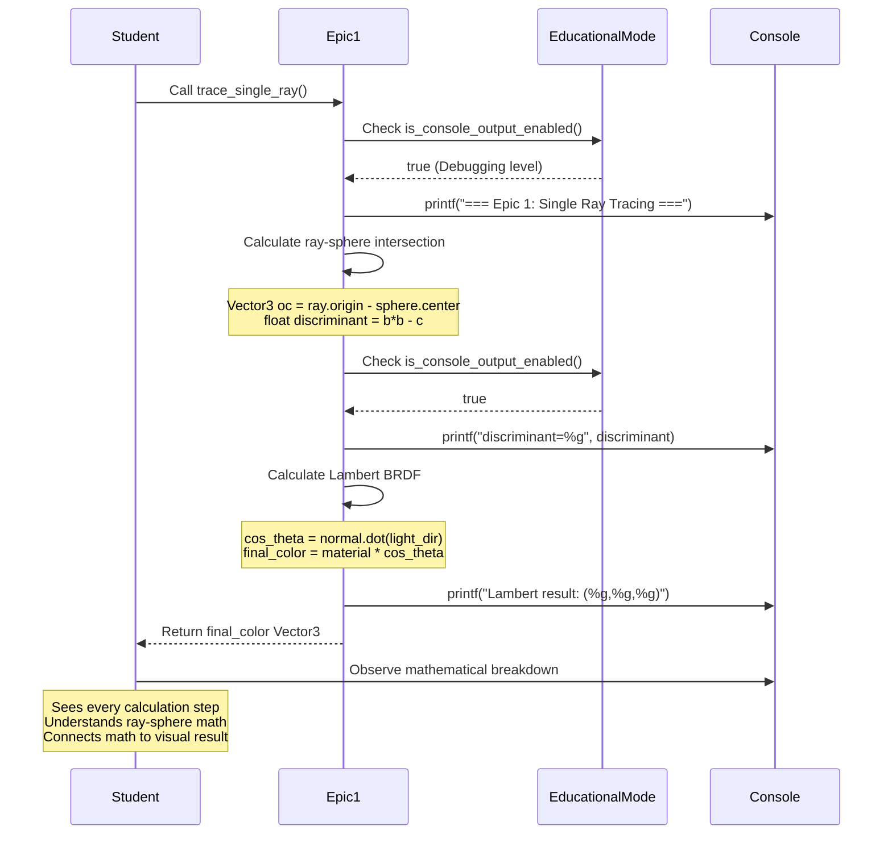
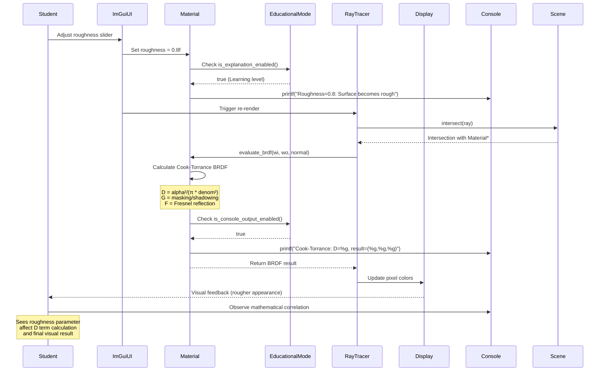

# Core Workflows

The core workflows illustrate key system interactions across the epic progression, showing how educational transparency integrates with mathematical calculations and user interactions.

## Epic 1: First Ray Tracing Experience Workflow

## Epic 2: Real-time Material Parameter Manipulation Workflow

