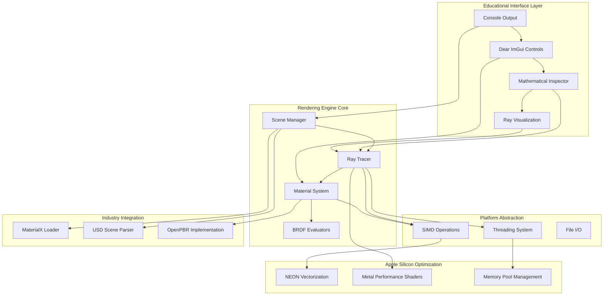

# High Level Architecture

## Technical Summary

The **3D Pathtracer Learning Project** implements a **modular native C++ architecture** with progressive complexity management, deployed as a **single educational executable** with console-to-GUI interface evolution. The **Apple Silicon-optimized rendering backend** integrates with a **lightweight educational frontend** (Dear ImGui) through a **plugin-based renderer abstraction**. Key integration points include **real-time parameter binding** between UI controls and BRDF calculations, **educational debugging visualization** overlays, and **industry-standard content pipeline** (MaterialX/USD) integration. The architecture supports **seamless platform abstraction** while optimizing for Apple Silicon NEON vectorization and Metal Performance Shaders, achieving PRD goals through **incremental feature progression** from single-ray console output to production-quality hybrid rendering with comprehensive mathematical transparency.

## Platform and Infrastructure Choice

**Platform:** Apple Silicon (macOS) with cross-platform abstraction layer  
**Key Services:** Native C++ executable, Dear ImGui UI framework, Metal Performance Shaders, NEON vectorization  
**Deployment Host and Regions:** Local development environment (single-user educational tool)

## Repository Structure

**Structure:** Educational Monorepo with Epic Progression  
**Monorepo Tool:** Custom CMake configuration (not Nx/Turborepo - those are for web projects)  
**Package Organization:** Epic-based modules with clear educational progression and shared mathematical foundations

## High Level Architecture Diagram

## Architectural Patterns

- **Educational Progression Pattern:** Incremental complexity management from single-file to modular architecture - _Rationale:_ Allows students to understand each abstraction layer as it's introduced rather than overwhelming with full architecture complexity

- **Plugin-Based Renderer Architecture:** Abstract renderer interface supporting console, software, and future GPU backends - _Rationale:_ Enables experimentation with different rendering approaches while maintaining educational interface consistency

- **Mathematical Transparency Pattern:** Every calculation exposed through debugging interfaces with step-by-step breakdown - _Rationale:_ Core educational requirement for understanding ray tracing mathematics in practice

- **Platform Abstraction with Optimization Hooks:** Cross-platform base implementation with platform-specific optimization injection points - _Rationale:_ Balances educational accessibility with Apple Silicon optimization learning objectives

- **Industry Standards Integration Pattern:** Gradual introduction of MaterialX/USD through educational wrappers before full industry API exposure - _Rationale:_ Prevents external library complexity from overwhelming core graphics learning

- **Performance Monitoring as Educational Tool:** Built-in profiling and statistics generation for educational insight rather than production optimization - _Rationale:_ Students learn optimization thinking through measurement and analysis, not just theoretical knowledge
